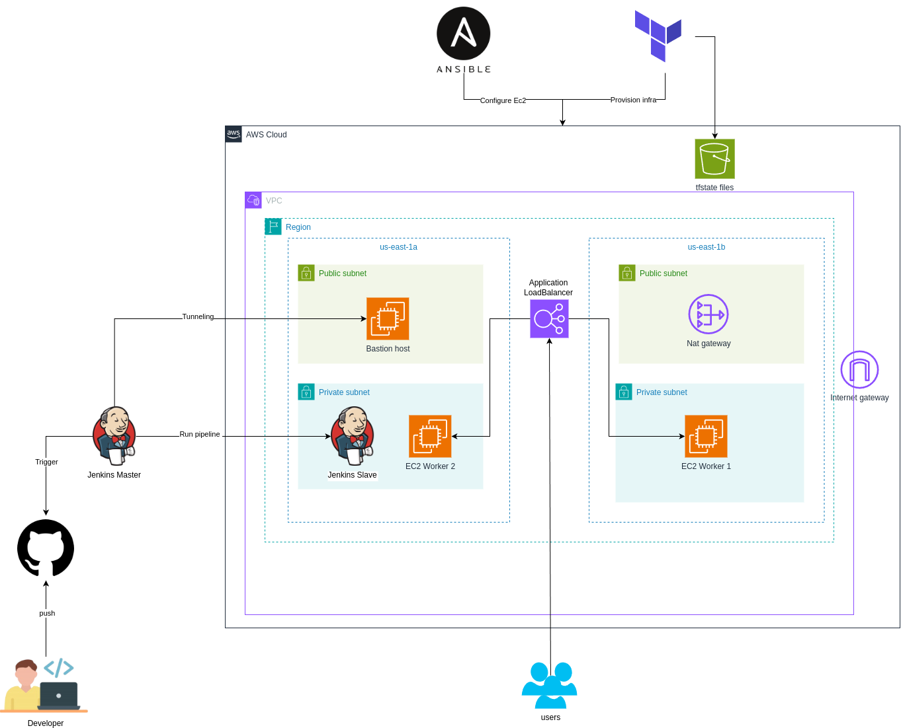
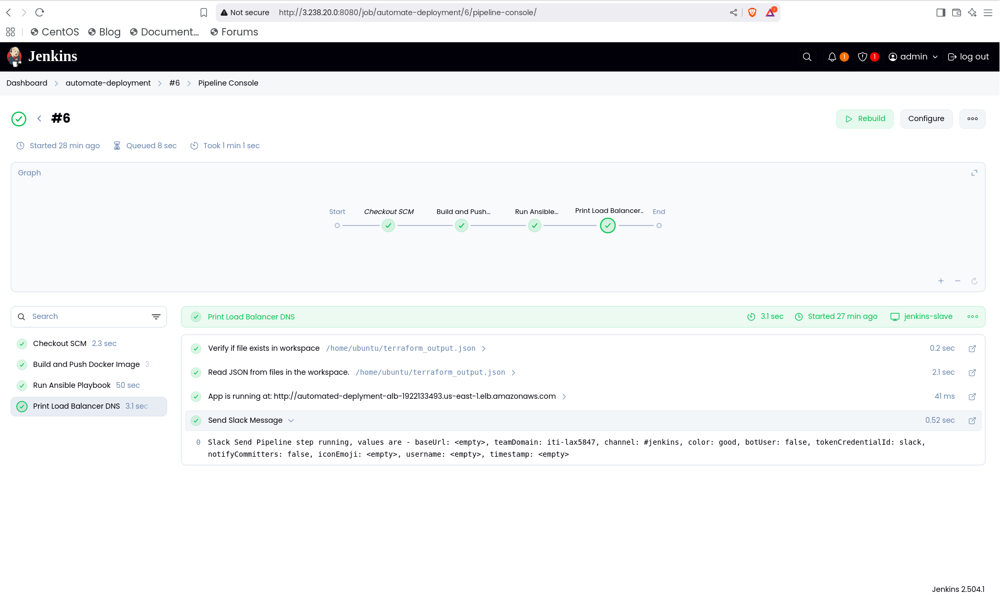
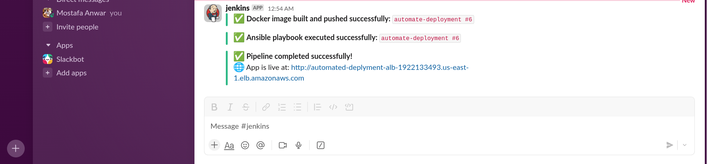
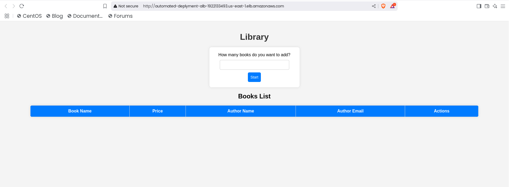
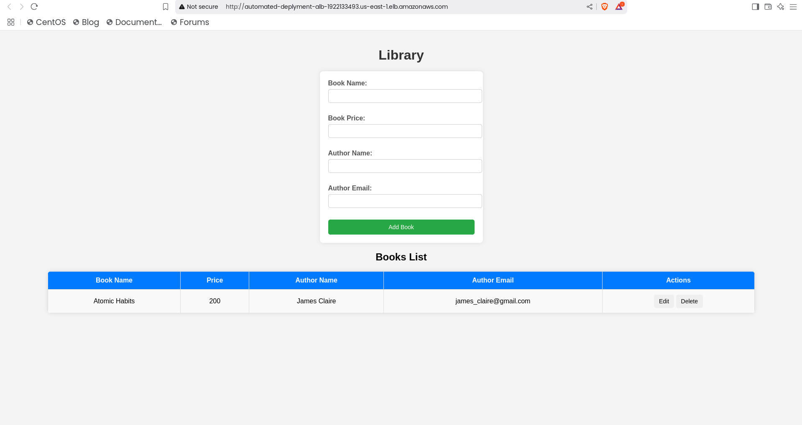

# 🚀 Automated Deployment on AWS

This project automates the deployment of a static web application using **Terraform**, **Ansible**, and **Jenkins** on **AWS Cloud**. It provisions a scalable, secure infrastructure, configures all necessary services, and deploys a Web App frontend (served via Nginx) through a fully automated CI/CD pipeline.

---

## 📦 Tech Stack

- **Terraform** – Infrastructure as Code (IaC) to provision AWS resources  
- **Ansible** – Configuration management for EC2 instances  
- **Jenkins** – CI/CD pipeline runner  
- **AWS** – Cloud provider (VPC, EC2, ALB, NAT Gateway, S3 Backend)  
- **Nginx** – Serves a static frontend (HTML/CSS/JS)

---

## 🧱 Architecture Overview



- **VPC** with 2 public subnets and 2 private subnets across two AZs  
- **Bastion Host** (Public) for SSH tunneling into private instances  
- **NAT Gateway** for outbound internet access from private instances  
- **Private EC2 Instances**:  
  - Jenkins Slave  
  - 2 Worker Nodes  
- **Application Load Balancer** (ALB) routing traffic to worker nodes  
- **S3 Bucket** for Terraform remote state management

---

## 📂 Project Structure

```text
automated-nodejs-deployment/
├── ansible/
│   ├── jenkins-slave/
│   ├── private-instances/
│   ├── inventory
│   ├── ansible.cfg
│   ├── jenkins-slave-playbook.yaml
│   └── private-instances-playbook.yaml
├── app/
│   ├── Dockerfile
│   ├── index.html
│   ├── script.js
│   └── style.css
├── terraform/
│   ├── modules/
│   │   ├── alb/
│   │   ├── bastion/
│   │   ├── private_instances/
│   │   ├── security_groups/
│   │   └── vpc/
│   ├── backend.tf
│   ├── main.tf
│   ├── outputs.tf
│   ├── variables.tf
│   └── terraform.tfvars
├── Jenkinsfile
├── deploy.sh
├── ssh-config.sh
├── automated-nodejs-key.pem
├── terraform_output.json
└── README.md
```

## 🛠 How It Works

**1. Infrastructure Provisioning (Terraform)**

  - Create a VPC with 2 public and 2 private subnets
  
  - Deploy EC2 instances: Bastion, Jenkins slave, and 2 worker nodes
  
  - Set up NAT gateway, security groups, and an Application Load Balancer
  
  - Remote backend configured with S3 and state locking enabled

**2. Instance Configuration (Ansible)**

  - Configure Jenkins slave with Docker and dependencies

  - Prepare worker nodes to run the containerized frontend app

**3. CI/CD Pipeline (Jenkins)**

  - Jenkins slave is triggered to:

      - Pull application code from GitHub

      - Build a Docker image

      - Push the image to a container registry

      - Run the app on worker nodes using an Ansible playbook

**4. Connectivity**

  - All private instances are accessed securely via SSH through the Bastion host

  - ssh-config.sh script auto-generates SSH config using Terraform outputs

## 🚀 Getting Started
**Prerequisites**
Before running this project, ensure you have:

- AWS CLI configured with appropriate permissions
- Terraform >= 1.0 installed
- Ansible >= 2.9 installed
- SSH key pair generated for AWS EC2 access
- Docker Hub account for container registry

## ⚡ Quick Start

** 1.  Clone the repository **
```bash
  git clone [https://github.com/Mostafa-Anwar-101/automated-nodejs-deployment](https://github.com/Mostafa-Anwar-101/automated-nodejs-deployment.git)
  cd automated-nodejs-deployment
```
** 2. Run the automated deployment **
```bash
./deploy.sh
```
**This script handles the complete deployment process:**

  - Applies Terraform configurations to build AWS infrastructure
  - Configures SSH settings for seamless bastion host access
  - Runs Jenkins slave playbook

---

## 🧪 Jenkins Pipeline

**🧭 CI/CD Workflow**

```text
 GitHub Push ➜ Jenkins Trigger ➜ Docker Build ➜ Docker Hub Push ➜ Ansible Deploy ➜ Get ALB DNS
```


 Integrated with Slack 
 
 using webhook with GitHub
 The CI/CD pipeline automates the entire application lifecycle:

  - **Container Building:** Creates Docker images with application code
  - **Registry Push:** Uploads images to Docker Hub for distribution
  - **Deployment Execution:** Runs Ansible playbooks to deploy containers on worker nodes
  - **Health Verification:** Confirms successful deployment through load balancer health checks

---

## 🔐 Security Features
- **Network Security:** Private subnets isolate critical infrastructure components from direct internet access.
- **Access Control:** Bastion host provides a single, monitored entry point for administrative access.
- **SSH Configuration:** Automated SSH config setup enables seamless tunneling through the bastion host to reach private instances.
- **Security Groups:** Granular firewall rules restrict traffic to only necessary ports and sources.

---

## Verify App is Up and running

- Click on the ALB DNS to verify the application is live:






